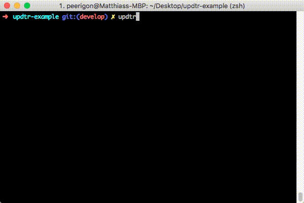

# updtr

**Update outdated npm modules with zero pain™**

[](https://travis-ci.org/peerigon/updtr)
[](https://www.npmjs.com/package/updtr)
[](https://www.npmjs.com/package/updtr)
[](https://coveralls.io/github/peerigon/updtr?branch=master)

Based on `npm outdated`, **updtr** installs the latest version and runs `npm test` for each dependency. If the test succeeds, **updtr** saves the new version number to your `package.json`. If the test fails, however, **updtr** rolls back its changes.



## Installation

```
npm install -g updtr
```

## Options

```
➜  ~  updtr -h

  Usage: updtr [options]

  Update outdated npm modules with zero pain™

  Options:

    -h, --help                 output usage information
    -V, --version              output the version number
    -R, --reporter <reporter>  choose reporter: default, shy
```

## License

Unlicense
